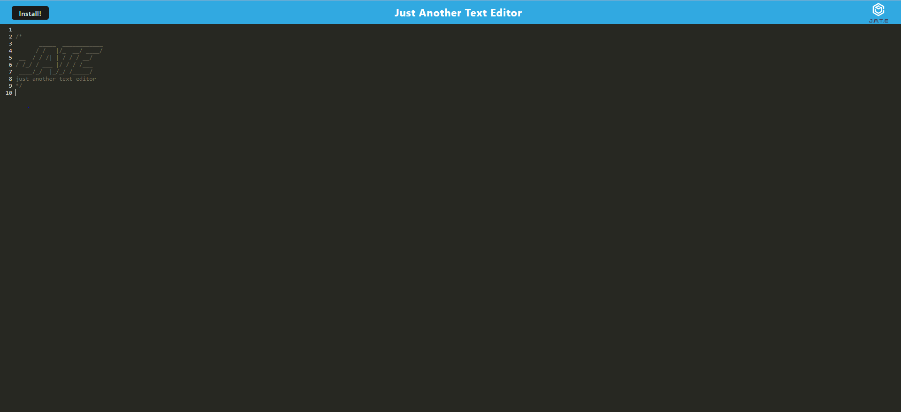

# Text-Editor

# Description

Welcome to JATE, just another text editor. JATE is a simple to use text editor where you can even use offline. even uses a database to make sure you dont loose that data you just typed out.

# Table of Contents

- [Description](#description)
- [Instructions](#instructions)
- [Usage](#usage)
- [Technologies Used](#technologies)
- [Questions / Contact](#questions--contact)

# Instructions

In order to be able to use this app go to the following link provided and you will be able to use it.You can download it if you want to use it for the offline.

# Usage

# Technologies

- JavaScript
- Node.js
- Express.js
- Webpack
- Heroku

# Questions / Contact

[Click here](https://github.com/Drewpayton/Text-Editor) for the repository for this project

If any questions please contact me @ drewpayton18@gmail.com

contacts:

- [Github](https://github.com/Drewpayton)
- [Linkedin](https://www.linkedin.com/in/drewpayton2018/)
- [Portfolio](https://drewpayton.github.io/personal-portfolio/)
